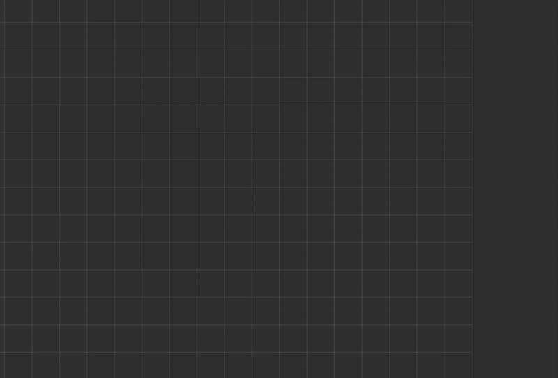

## Results


(The original video can be found in the resources folder if needed).

## Environment
- Ubuntu 22.04.4
- ROS2 Humble
- Tested on Intel Ultra 9 185H, 32GB RAM

## Dependencies
```
sudo apt update
sudo apt install nlohmann-json3-dev
sudo apt install ros-humble-tf2 ros-humble-tf2-geometry-msgs os-humble-visualization-msgs
sudo apt-get install libboost-all-dev
```

## Run the full demo
```
source install/setup.bash
ros2 launch object_tracking object_tracking.launch.py
```

## Run individual nodes
Run each node in a different terminal (remember to source the workspace).

### Sensor data publisher
```
ros2 run object_tracking sensor_data_publisher
```
### Transform detections
```
ros2 run object_tracking transform_detections
```

### Object tracker
```
ros2 run object_tracking object_tracker
```

## Brief explanation of each node

### sensor_data_publisher

This node uses the JSON file data to publish the robot poses and detections. The robot poses are published as a ROS2 Pose message and the detections as PoseArray message. In order to simulate the data being published, the elapsed time is calculated according to the timestamp from the JSON file. These 2 methods run asynchronously by using the MultiThreadedExecutor from Ros2. The robot path is published once in the constructor, only for visualization purposes.

### transform_detections

It subscribes to the detections topic and uses tf2::Transform to convert the incoming poses from the robot CS to the global CS, and publishes them in a different topic as PoseArray message. The frame_id is the same as the robot poses (map) to visualize the data in rviz2. The tf2::Transform is as follows:

```
for (const auto& pose : msg->poses)
  {
    // Convert robot pose to tf2 transform
    tf2::Transform tf_robot_to_map;
    tf2::fromMsg(current_robot_pos_.pose, tf_robot_to_map);
    
    // Convert incoming pose to tf2 transform
    tf2::Transform tf_sensor_to_robot;
    tf2::fromMsg(pose, tf_sensor_to_robot);
    
    // Transform
    tf2::Transform tf_transformed = tf_robot_to_map * tf_sensor_to_robot;
    
    // Convert back to geometry_msgs::msg::Pose and store
    geometry_msgs::msg::Pose transformed_pose;
    tf2::toMsg(tf_transformed, transformed_pose);
    last_poses_.poses.push_back(transformed_pose);
  }
```

### object_tracker (Tracking requirements of the module)

**1. The objects should be reported in the global CS:** the objects are already reported in the global CS from the previous node.

**2. The objects orientation should not flip:** to avoid 180 flips, the angle is 'stabilized' and normalized based on the difference to the last angle:
```
double ObjectTracker::stabilize_yaw(double prev_yaw, double new_yaw){
  // Flip angle 180 if needed 
  if (std::abs((new_yaw - prev_yaw)) > M_PI_2) {
    new_yaw += M_PI;
  }
  // Normalize angle between 0 and 2*PI
  while (new_yaw > M_PI) 
    new_yaw -= 2 * M_PI;
  while (new_yaw <= -M_PI) 
    new_yaw += 2 * M_PI;

  return new_yaw;
}
```
After the angle is flipped (if needed), an exponential filter is also used to reduce disturbances from 90-degree jumps:
```
double stable_yaw = stabilize_yaw(prev_yaw, new_yaw);
double filtered_yaw = 0.8 * prev_yaw + 0.2 * stable_yaw;
```

**3. The objects should be tracked in memory for a short time period even if no new detection is reported:** to keep track of the objects a struct is used as follows:
```
struct TrackedObject {
  int id;
  geometry_msgs::msg::PoseStamped pose;
  rclcpp::Time last_seen;
  double certainty;
  MovingAverageFilter x_filter{60};
  MovingAverageFilter y_filter{60};
};
```
An unordered_map is used to store each unique ID and object:
```
std::unordered_map<int, TrackedObject> tracked_objects_;
```
The objects are tracked based on euclidean distance considering only the position due to the yaw angle is not reliable:
```
int ObjectTracker::find_matching_object(const geometry_msgs::msg::Pose& pose, double threshold = 0.5) {
  for (auto& [id, obj] : tracked_objects_) {
    double dx = obj.pose.pose.position.x - pose.position.x;
    double dy = obj.pose.pose.position.y - pose.position.y;
    // Euclidean distance to find object
    if (std::sqrt(dx * dx + dy * dy) < threshold) {
      return id;
    }
  }
  return -1;
}
```
The tracked objects are published with a timer of 100 ms, so we can track them for a short period even if no new detection is reported.

**4. The objects should feature a unique ID:**: assign a unique ID when a new object is detected (which only happens if the method 'find_matching_object' did not find any match):
```
int ObjectTracker::assignID() {
  return next_id++;
}
```

**5. The objects should feature a level of certainty:** an initial level of certainty (0.5) is assigned to each new object. This level increases or decreases by a 'certainty_delta' factor depending on whether it was detected or not in the current time.

**6. The objects should be deleted after a longer period with no detection:** each tracked object contains a timestamp of when it was last seen so we can calculatehow long it's been since it's last detection, and remove it if that value is bigger than the timeout (5 seconds):
```
for (auto it = tracked_objects_.begin(); it != tracked_objects_.end();) {
  if ((now - it->second.last_seen).seconds() > timeout_duration) {
    RCLCPP_INFO(this->get_logger(), "Object '%d' removed due to timeout.", it->second.id);
    it = tracked_objects_.erase(it);
  }
  else {
    ++it;
  }
}
```

Note: a message of type MarkerArray is published to visualize the ID and certainty of each detected object in rviz2.
